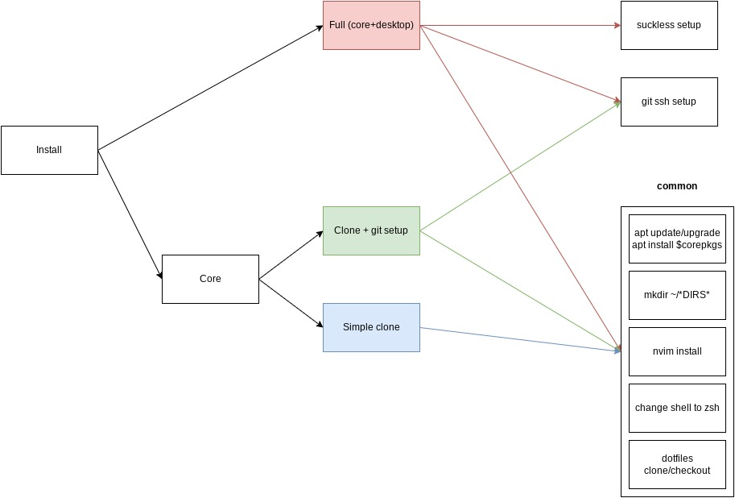

# rice
This repo contains a bootstraping script that sets up my environemnt from scratch on a Debian machine, and clones my dotfiles repo.
Also, trying to unclutter ~/ moving dotfiles to ~/.config when possible (https://wiki.archlinux.org/title/XDG_Base_Directory).

## What I use:
- Debian stable
- Suckless.org software:
  - dwm
  - dmenu
  - st
- neovim/lazy vim (work in progress)
- a git bare repo to track my doftiles (github.com/crlxs/dotfiles)

## Work in progress:
- Convert setup.sh into an ansible playbook (setup.yaml).

## To-dos
- Use ansible-vault for git ssh setup to avoid the pain in the ass that is managing ssh keys.

## Shortcuts

### Basic

MODKEY = WindowsKey

- **Spawn new terminal**: MODKEY + Shift + Enter
- **Kill selected window**: MODKEY + Shift + c
- **Open dmenu**: MODKEY + p
- **Hide/Show bar**: MODKEY + b
- **Exit dwm**: MODKEY + Shift + q
- **Fullscreen selected window**: MODKEY + Shift + f

### Layouts

- **Tile layout ([]=)**: MODKEY + t
- **No layout (><>)**: MODKEY + f
- **Monocle layout ([M])**: MODKEY + m

### Gaps

- **Increase gaps**: MODKEY + (+)
- **Decrease gaps**: MODKEY + (-)

### Opacity

- **Increase focused opacity**: MODKEY + Shift + z
- **Decrease focused opacity**: MODKEY + Shift + x

- **Increase unfocused opacity**: MODKEY + Shift + a
- **Decrease unfocused opacity**: MODKEY + Shift + s

### Terminal (st) specific

TERMMOD = Control + Shift

- **Zoom in**: TERMMOD + PgUp
- **Zoom out**: TERMMOD + PgDown

- **Scrollup**: Shift + Pgup
- **Scrolldown**: Shift + PgDown

## Diagram

Small diagram of the decision tree for the install process, this is not yet fully implemented but its the idea. Either through shell script with the different choices asked or by the use of tags with the ansible playbook.

