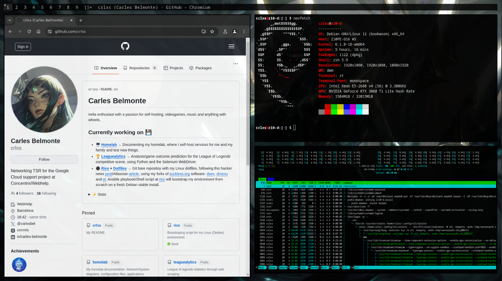

# rice
This repo contains a bootstraping script/ansible-playbook that sets up my environment from scratch on a Debian machine, and clones my dotfiles repo.
Also, trying to unclutter ~/ moving dotfiles to ~/.config when possible (https://wiki.archlinux.org/title/XDG_Base_Directory).

You can either:
- Download and execute the shell script "./setup.sh".
- Execute the ansible playbook with: 
> ansible-playbook -t TAGS setup.yaml --ask-become-pass --ask-vault-pass

- This is what it currently looks like:

## What I use:
- Debian stable (12 as of now)
- [Suckless.org](suckless.org) software:
  - dwm
  - dmenu
  - st
- Neovim/lazy vim (work in progress)
- A git bare repo to track my doftiles (github.com/crlxs/dotfiles)
- Ansible: Environment deployment.
- Ansible-vault: Encryption of SSH private key (./ssh/id_rsa) so it can safely be in this repo and reused.

## Work in progress:
- Rewrite ansible playbook (setup.yaml) and structure to properly use roles/handlers/tags.

## To-dos
- [ ] Install swallow patch for dwm
- [ ] Transform playbook setup.yaml to role based playbook and tags usage.
- [ ] Ansible handler to clone with ssh instead of https if gitssh task has been setup. With the current tasks (cloning with https and setting up git with ssh), I cant push changes to my dotfiles repos because it fails authentication. I just realized this can be done by simply changing the remote configured in ~/.dotfiles/config.
- [ ] zsh/nvim customization
- [x] Use ansible-vault for git ssh setup to avoid the pain in the ass that is managing ssh keys. (COMPLETED June 3rd, 2024).
- [x] Convert setup.sh into an ansible playbook (setup.yaml). (COMPLETED June 3rd, 2024).

## Shortcuts

### Basic

MODKEY = WindowsKey

- **Spawn new terminal**: MODKEY + Shift + Enter
- **Spawn new browser**: MODKEY + w
- **Kill selected window**: MODKEY + Shift + c
- **Open dmenu**: MODKEY + p
- **Hide/Show bar**: MODKEY + b
- **Exit dwm**: MODKEY + Shift + q
- **Fullscreen selected window**: MODKEY + Shift + f

### Layouts

- **Tile layout ([]=)**: MODKEY + t
- **No layout (><>)**: MODKEY + f
- **Monocle layout ([M])**: MODKEY + m

### Gaps

- **Increase gaps**: MODKEY + (+)
- **Decrease gaps**: MODKEY + (-)

### Opacity

- **Increase focused opacity**: MODKEY + Shift + z
- **Decrease focused opacity**: MODKEY + Shift + x

- **Increase unfocused opacity**: MODKEY + Shift + a
- **Decrease unfocused opacity**: MODKEY + Shift + s

### Terminal (st) specific

TERMMOD = Control + Shift

- **Zoom in**: TERMMOD + PgUp
- **Zoom out**: TERMMOD + PgDown

- **Scrollup**: Shift + Pgup
- **Scrolldown**: Shift + PgDown

## Diagram

Small diagram of the decision tree for the install process, this is not yet fully implemented but its the idea. Either through shell script with the different choices asked or by the use of tags with the ansible playbook.

